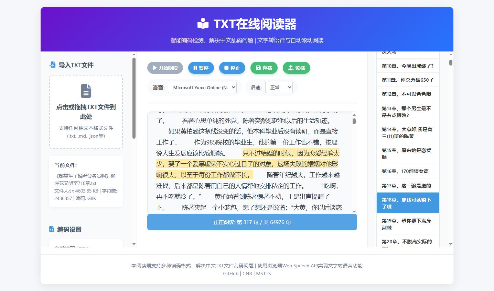

# MSTTS TXT在线听书文字转语音阅读器
演示：https://www.bilibili.com/video/BV1WZrPBsEjw/

> 推荐使用Edge游览器使用。

## 个人说明
1. 获取章节列表正则：`const chapterRegex = /^第[一二三四五六七八九十零〇百千万\d\s]{1,10}[章节卷集部篇回].+$/gm;`
2. **TXT内容分割是以章节与换行做分割**
3. 推荐使用EmEditor软件制作宏来编辑TXT
## 功能特点

- **智能编码检测** - 自动检测文件编码格式，解决中文TXT文件乱码问题
- **文字转语音** - 使用浏览器Web Speech API实现TTS朗读功能
- **自动滚动** - 播放时页面自动滚动并高亮当前朗读内容
- **章节导航** - 自动识别章节标题，支持快速跳转
- **存档读档** - 保存和恢复阅读进度
- **多语速支持** - 支持0.5x到3x的语速调节
- **多种语音** - 支持选择系统中可用的语音（优先中文语音）

## 使用方法

1. **导入文件** - 点击左侧"导入TXT文件"区域或直接拖拽TXT文件到该区域
2. **解决乱码** - 如果文本显示乱码，在左侧选择不同的编码格式，然后点击"使用新编码重新加载"
3. **开始朗读** - 点击"开始朗读"按钮
4. **暂停/停止** - 点击"停止"按钮暂停朗读
5. **跳转位置** - 点击任意段落可从该位置开始朗读；点击右侧章节列表可跳转到对应章节
6. **调节设置** - 可调节语速和选择不同的语音
7. **存档读档** - 使用"存档"和"读档"按钮保存和恢复阅读进度

## 支持的编码

- 自动检测（推荐）
- UTF-8
- GBK / GB2312（简体中文）
- Big5（繁体中文）
- ISO-8859-1（西欧）

## 支持的文件格式

- .txt
- .md
- .json
- .html
- .css
- .js
- .xml
- .csv

## 技术栈

- 纯HTML/CSS/JavaScript，无需后端
- Web Speech API（语音合成）
- localStorage（本地存储进度）

## 相关链接

- GitHub: http://github.com/IIIStudio/MSTTS
- CNB: https://cnb.cool/IIIStudio/HTML/MSTTS
- 在线演示: https://iiistudio.github.io/MSTTS/

## 浏览器兼容性

需要支持Web Speech API的现代浏览器，推荐使用：
- Chrome/Edge 33+
- Safari 7+
- Firefox 49+

## 图片

## 许可证

本项目为开源项目，欢迎自由使用和修改。
